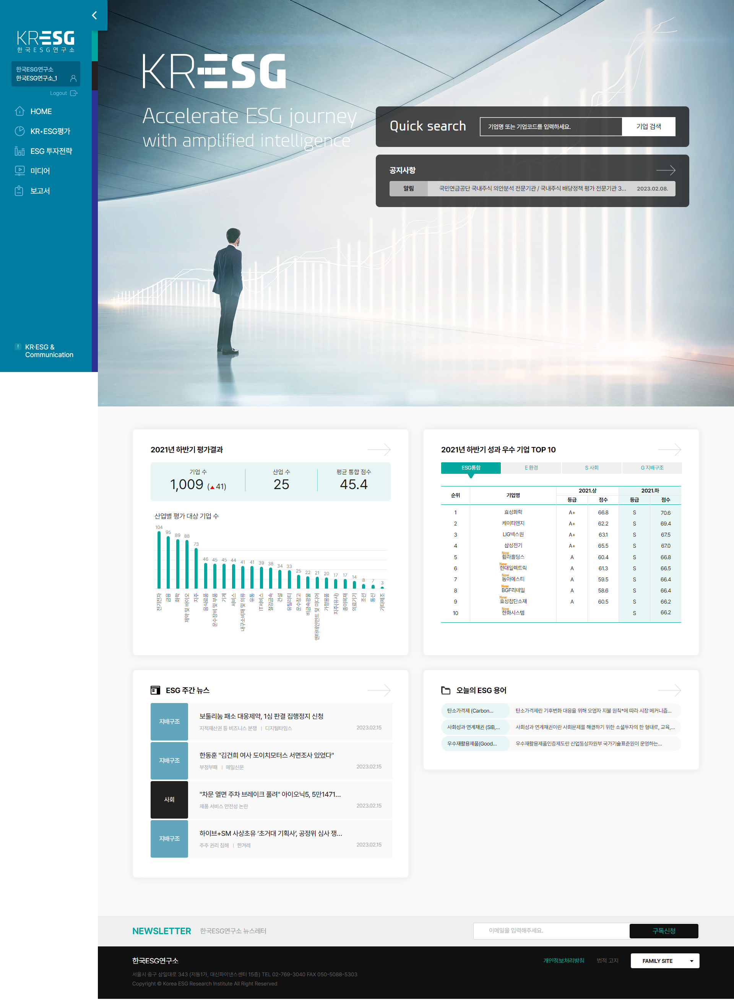
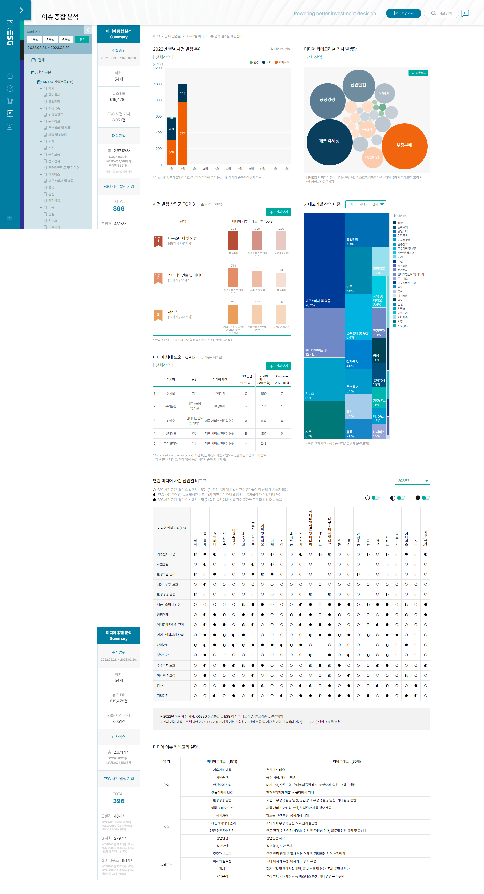
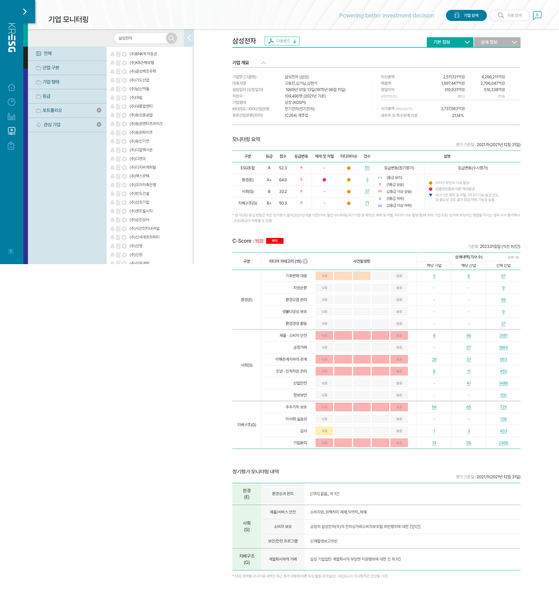
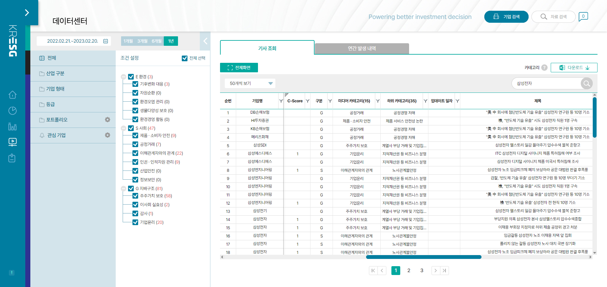
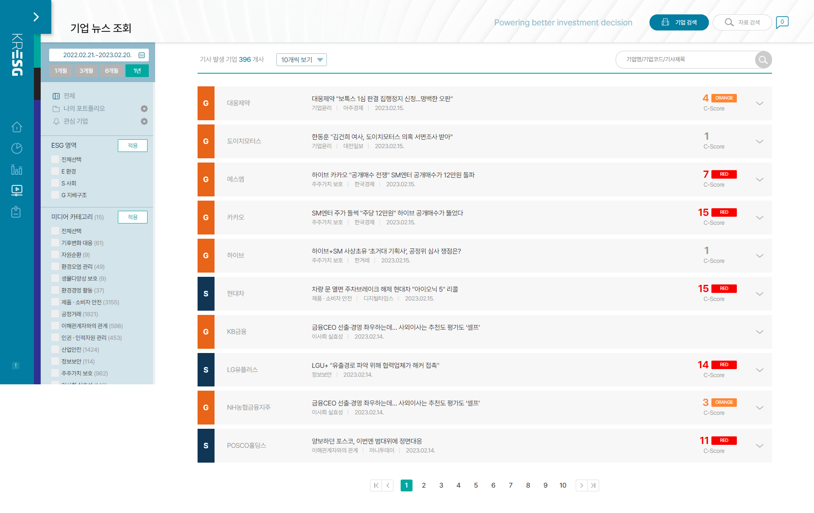

[KESG Media Portal Site](http://portal.kresg.co.kr/)
[Tutorial : Simple ML Pipeline with Kubernetes + Restful API ]()

0. Skill & HW
- Kubernetes : Microk8s ( 1 Master + 2 Worker)
- Github Action 
- Restful API : Flask
- Front : Dash for ProtoType
- DataBase : Postgres , mySQL
- GPU : RTX 3090 x 2 

1. Why Kubernetes? 
- When there were many samples or intermittent network problems, people had to repair them after monitoring each time.
Therefore, self-healing-enabled Kubernetes automates these monitoring and repairs to reduce labor costs.
- Since large-scale traffic could occur in the future, the Load Balance function was required.
- Monitoring functions such as grafana can be set conveniently.
- Despite the resource limitations of single-person development, many useful functions can be easily implemented.

2. Why Github Action?
- With Github Action, only docker image and manaifest commit - push on the development server is configured so that the function can be applied directly to the service server.

3. Why Restful-API?
- Service expansion is planned in the future, and it is configured to reuse existing functions by separating them into functional units.

4. 시스템 요소 
- 시스템 구성도 작성 

5. 실제 서비스 화면 

 

 

 

 

